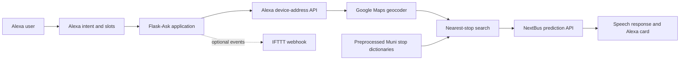

# SF Muni Alexa Skill

SF Muni is a voice application that answers a practical question: **when will the next vehicle on a requested route arrive at the stop closest to me?**

I built it as an Alexa skill in 2017, backed by a Python/Flask application. It combines Alexa device-location permissions, Google Maps geocoding, a preprocessed map of Muni stops, and live NextBus arrival data. The application was designed for serverless deployment to AWS Lambda with Zappa.

> This repository preserves a legacy Python 2 implementation and the APIs and libraries available when it was built. It is best viewed as a portfolio artifact and architecture case study. Minor code changes (e.g. sanitization) were made to make it public on github with the use of AI. This application was initially submitted to the Alexa skill store but is not currently available. 

## What the user experiences

A rider can ask something like:

> Alexa, ask SF Muni when the next 38 inbound arrives.

The skill retrieves the permitted Alexa device address, converts it to coordinates, finds the nearest stop serving that route and direction, obtains live predictions, and speaks the result back to the rider. It also creates a simple Alexa card containing the same result.

## Architecture

For deployment, Zappa packages the Flask application for AWS Lambda and exposes it through the serverless HTTP endpoint used by the Alexa skill.

## Request flow

1. **Understand the request.** Flask-Ask maps the Alexa `GetTime` intent into `route` and `direction` slots.
2. **Handle speech variations.** The application accounts for cases where Alexa combines a route and direction or hears variants such as “in down.”
3. **Request location with consent.** The skill uses Alexa's device-address API and the user's permission token. It returns a useful prompt when address permission or a complete address is missing.
4. **Geocode the address.** Geopy's Google provider turns the address into latitude and longitude using a private API key supplied through the environment.
5. **Find the nearest valid stop.** The code narrows the search to the requested route and direction, calculates the Vincenty distance to each candidate stop, and retains the closest one.
6. **Retrieve live predictions.** The selected route and stop ID are sent to the public NextBus JSON endpoint.
7. **Normalize the response.** The parser handles single or multiple destinations, converts prediction seconds to minutes, and accounts for no-prediction and error responses.
8. **Build the voice response.** The result includes the closest cross streets, destinations, arrival estimates, and relevant service messages.
9. **Log optional events.** When `IFTTT_WEBHOOK_KEY` is configured, the original webhook integration records request lifecycle events. Without the key, it safely does nothing.

## Data preparation

The runtime avoids repeatedly downloading and reshaping the full stop dataset. Instead, utility scripts convert CSV stop data into Python dictionaries:

- `data.py` maps route and direction to stop IDs and cross streets.
- `data_lat_lon.py` adds latitude and longitude for nearest-stop calculations.
- `utilities/createDict.py` builds the route/direction/stop structure.
- `utilities/createDictLatLon.py` builds the coordinate-aware structure.
- `utilities/matching.py` explores fuzzy street-name matching for the earlier cross-street input design.

This is a deliberate latency tradeoff: preprocessing makes serverless requests simple and fast, but transit-data updates require rebuilding the generated dictionaries.

## Technology used

The preserved environment shows the original stack:

| Area | Technology | Role |
| --- | --- | --- |
| Voice interface | Amazon Alexa Skills Kit | Intent, slots, permissions, speech, and cards |
| Web application | Python 2.7, Flask 0.12.1 | Request handling and application logic |
| Alexa integration | Flask-Ask 0.9.6 | Alexa request/response decorators and helpers |
| Deployment | Zappa 0.44.3, AWS Lambda/API Gateway | Serverless packaging and hosting |
| HTTP | Requests 2.18.4 | Alexa address, NextBus, and IFTTT calls |
| Geocoding/distance | Geopy 1.11.0, Google Maps | Address coordinates and nearest-stop distance |
| Transit predictions | NextBus public JSON API | Live vehicle arrival estimates |
| Data preparation | Python CSV utilities | Generated route and stop lookup dictionaries |
| Matching experiment | FuzzyWuzzy 0.15.1 | Approximate cross-street matching |
| Optional logging | IFTTT webhook | Lightweight request lifecycle logging |

## Security and privacy

No credentials are stored in the public repository. The application reads:

- `GOOGLE_MAPS_API_KEY`
- `IFTTT_WEBHOOK_KEY` (optional)

Copy `.env.example` to the ignored `.env` file for a local record, then export those values into the process environment. For Zappa deployment, copy `zappa_settings.example.json` to the ignored `zappa_settings.json` and replace its placeholders locally.

The public cleanup also removed debug output that could expose Alexa permission tokens, full addresses, or precise coordinates. See `SECURITY.md` for the repository policy.

## Important design decisions

- **Route-aware nearest-stop search:** the nearest physical stop is not necessarily useful, so candidates are filtered by route and direction before distance comparison.
- **Precomputed lookup data:** this reduces runtime network work and keeps Lambda execution straightforward.
- **Graceful optional integrations:** IFTTT logging is disabled when its secret is absent rather than preventing the main feature from working.
- **Permission-aware location access:** the skill explicitly handles missing Alexa address consent or incomplete device settings.
- **Variable API response handling:** NextBus can return dictionaries or lists depending on the number of destinations and predictions, so the parser supports both shapes.

## Repository map

- `sfmuni.py` — Alexa/Flask application and end-to-end request flow
- `findStops.py` — route-aware nearest-stop lookup
- `data.py` — generated stop and cross-street dictionary
- `data_lat_lon.py` — generated stop coordinate dictionary
- `utilities/` — offline data preparation and matching experiments
- `test-sfmuni.py` — original exploratory test harness
- `zappa_settings.example.json` — public-safe deployment template
